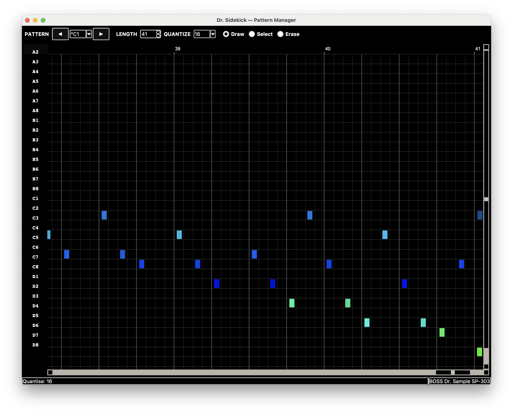

# Dr. Sidekick

**Boss Dr. Sample SP-303** Graphical pattern editor and SmartMedia librarian.


---




---

## What It Does

**Pattern Editor** — draw, edit, and arrange pad events on a piano-roll canvas

- 32 pad lanes across Banks A, B, C & D
- Draw, Select, and Erase editing modes
- Grid snapping: Free, 1/4, 1/8, 1/16, 1/32
- Multi-select, velocity editing, and quantize
- Copy/paste pattern slots, 50-level undo/redo
- MIDI import with PPQN conversion; up to 16 files into consecutive slots in one operation
- Apply SP-1200, MPC, Digitakt, or custom MIDI grooves
- Hardware-verified byte-perfect output

**SmartMedia Manager** — load a card setup, reassign pads, write changes back to the SmartMedia card

- Import WAV/AIFF with automatic format conversion (24-bit → 16-bit, stereo → mono)
- Auto-pad samples to 110ms minimum
- Reassign archived .SP0 samples to different pads
- Mix archived samples with new imports
- Generates byte-perfect SMPINFO0.SP0 metadata

**Quick Import WAV Folder** — prepare WAV sets for one-bank-at-a-time loading onto the SP-303

**Pack Library** — catalog and load sample packs and groove sets *(coming soon)*

**Backup / Restore** — create and restore full SP0 card backups

## Requirements

- Python 3.9 or later
- Tkinter (included with most Python distributions)
- macOS (primary target; Linux/Windows untested)
- `PTNDATA_INIT_OFFICIAL.bin` alongside `Dr_Sidekick.py` (included in this repo) — a byte-perfect initialization template captured from real SP-303 hardware. Without it the app falls back to a software-generated template that may not produce fully hardware-compatible files.

Optional: `tkinterdnd2` enables drag-and-drop support. The app runs without it.

## Run

```bash
python3 Dr_Sidekick.py
```

Or make it executable:

```bash
chmod +x Dr_Sidekick.py
./Dr_Sidekick.py
```

## Status

Beta. Core workflows are functional and have been tested against with SP-303 hardware.
Please report issues at [github.com/OneCoinOnePlay/dr-sidekick/issues](https://github.com/OneCoinOnePlay/dr-sidekick/issues).

## File Format Notes

Dr. Sidekick reads and writes the SP-303's native SmartMedia card format:

| File | Purpose |
|------|---------|
| `PTNDATA0.SP0` | Pattern event data (16 slots × 1024 bytes) |
| `PTNINFO0.SP0` | Pattern metadata and slot mapping (64 bytes) |
| `SMPINFO0.SP0` | Sample slot assignments (65 536 bytes) |
| `SMPxxxxL/R.SP0` | Sample audio data |

## User-Library

`User-Library/` holds local sample and groove assets:

```
User-Library/
  BOSS DATA_INCOMING/   # staging area for card reads
  BOSS DATA_OUTGOING/   # output for Quick Import WAV
  Songs/
```

The Pack Library indexes content here in `sp303_library_catalog.json`.

## Disclaimer

Dr. Sidekick is an independent community project and is not affiliated with, endorsed by, or supported by Roland Corporation or BOSS.

## License

© OneCoinOnePlay. All rights reserved.
