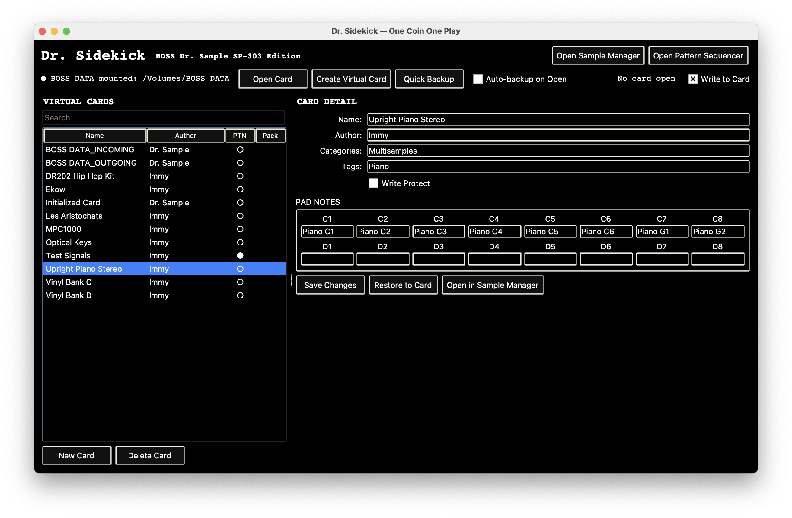
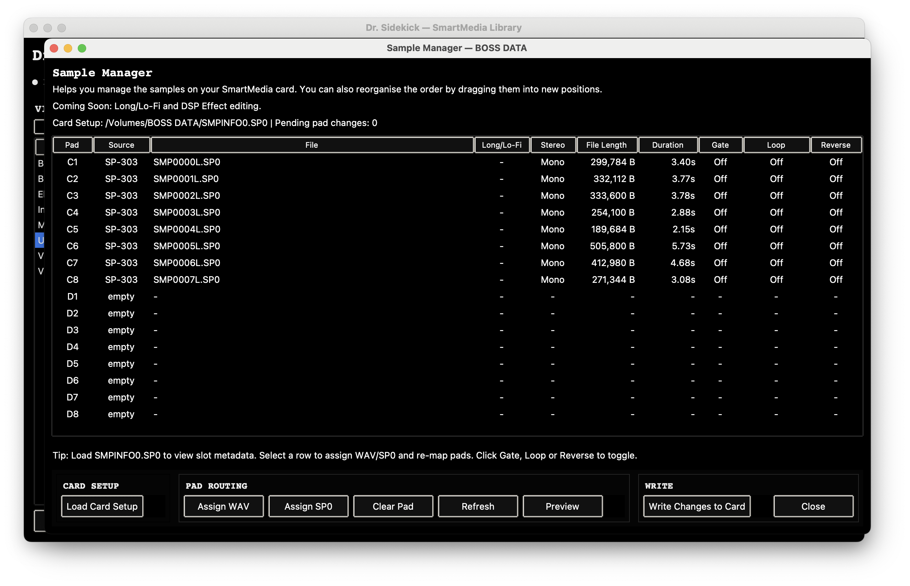

# Dr. Sidekick

**Boss Dr. Sample SP-303** Pattern Sequencer and SmartMedia librarian.


---






---

## What It Does

**Pattern Sequencer** — draw, edit, and arrange pad events on a piano-roll canvas

- 32 pad lanes across Banks A, B, C & D
- Draw, Select, and Erase editing modes
- Grid snapping: Free, 1/4, 1/8, 1/16, 1/32
- Multi-select, velocity editing, and quantize
- Copy/paste pattern slots, 50-level undo/redo
- MIDI import with PPQN conversion; up to 16 files into consecutive slots in one operation
- Apply SP-1200, MPC, Digitakt, or custom MIDI grooves
- SP-303-aware pattern handling: 2-bar default length, PTNINFO-backed slot mapping, 1-99 bar lengths, and hardware-style stepping above 20 bars
- Preserves hardware-authored duplicate hits and overdub-oriented timing semantics during decode

**SmartMedia Manager** — load a card setup, reassign pads, write changes back to the SmartMedia card

- Import WAV/AIFF with automatic format conversion (24-bit → 16-bit, stereo → mono)
- Auto-pad samples to 110ms minimum
- Reassign archived .SP0 samples to different pads
- Mix archived samples with new imports
- Preview archived SP0 samples with experimental RDAC decoding
- Convert SP0 samples to WAV
- Generates byte-perfect SMPINFO0.SP0 metadata

**SmartMedia Library** — virtual card management

- Create, rename, and organise virtual SmartMedia cards
- Archive full card contents (SP0 samples + SMPINFO + patterns)
- MPC1000 .pgm import for cross-device sample transfer

**Quick Import WAV Folder** — prepare WAV sets for one-bank-at-a-time loading onto the SP-303

**Backup / Restore** — create and restore full SP0 card backups

## Requirements

- Python 3.9 or later
- Tkinter (included with most Python distributions)
- macOS and Windows validated
- `PTNDATA_INIT_OFFICIAL.bin` alongside `Dr_Sidekick.py` (included in this repo) — a byte-perfect initialization template captured from real SP-303 hardware. Without it the app falls back to a software-generated template that may not produce fully hardware-compatible files.

Optional: `tkinterdnd2` enables drag-and-drop support. The app runs without it.

If you want drag-and-drop support on Windows PowerShell:

```powershell
py -3 -m pip install tkinterdnd2
```

## Run

```bash
python Dr_Sidekick.py
```

On Windows PowerShell, you can also use:

```powershell
py -3 Dr_Sidekick.py
```

On systems where `python` does not point to Python 3, use:

```bash
python3 Dr_Sidekick.py
```

Or make it executable:

```bash
chmod +x Dr_Sidekick.py
./Dr_Sidekick.py
```

## Status

Beta. Core workflows are functional and have been tested against SP-303 hardware.

Current release: `v0.7.4`

Recent pattern work:

- Pattern length now defaults to 2 bars to match SP-303 hardware
- Length editing follows the SP-303 rule: 1-20 in single-bar steps, then 4-bar steps up to 99
- PTNINFO bar-count and display-slot mapping are hardware-aligned
- `07031100` decoding preserves overdub timing by treating zero-delta note tuples as repeated prior steps
- Quantize changes are treated as in-stream PTNDATA state, not PTNINFO metadata

RDAC audio decoding is experimental — samples are recognisable but noisy. Structural accuracy (pattern selection, bit extraction, hierarchical interpolation) is confirmed with 0.93 spectral correlation to hardware output.

Please report issues at [github.com/OneCoinOnePlay/dr-sidekick/issues](https://github.com/OneCoinOnePlay/dr-sidekick/issues).

## File Format Notes

Dr. Sidekick reads and writes the SP-303's native SmartMedia card format:

| File | Purpose |
|------|---------|
| `PTNDATA0.SP0` | Pattern event data (16 slots × 1024 bytes) |
| `PTNINFO0.SP0` | Pattern metadata and slot mapping (64 bytes) |
| `SMPINFO0.SP0` | Sample slot assignments (65 536 bytes) |
| `SMPxxxxL/R.SP0` | Sample audio data (RDAC MT1 compressed) |

## SmartMedia Library

`SmartMedia-Library/` manages virtual cards and sample assets:

```
SmartMedia-Library/
  Cards/{card_name}/         # Virtual card contents (SP0 + metadata)
  AutoSaves/{card_name}/     # Timestamped card snapshots
  BOSS DATA_INCOMING/        # Staging area for card reads
  BOSS DATA_OUTGOING/        # Output for Quick Import WAV
```

## Disclaimer

Dr. Sidekick is an independent community project and is not affiliated with, endorsed by, or supported by Roland Corporation or BOSS.

## License

© OneCoinOnePlay. All rights reserved.
